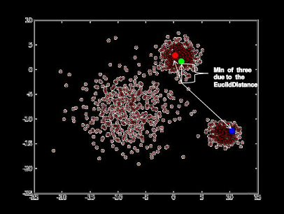
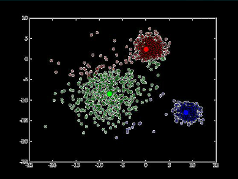
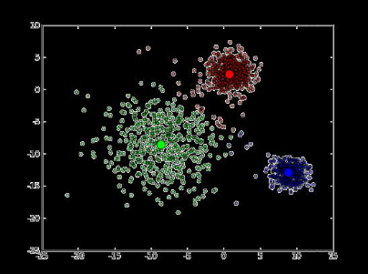

###K-Means聚束算法

#### 1）算法介绍
K-Means是一种基于距离的迭代式算法。  
将n个观察实例分类到k个聚类中，以使得每个观察实例距离它所在的聚类的中心点比其他的聚类中心点的距离更小。  

将每个观测实例都归类到距离它最近的聚类中心点，我们需要找到这些聚类中心点的具体位置。  

#### 2）算法过程

##### 1,取得K个初始中心点

##### 2,把每个点划分进相应的簇

##### 3,重新计算中心点

##### 4,迭代计算中心点

##### 5,收敛

* 1，从数据中随机抽取k个点作为初始聚类的中点，由这个中心代表各个聚类
* 2， 计算数据中所有点到这K个点的距离，将点归到离其最近的聚类里。
* 3， 调整聚类中心 ，即将聚类的中心一道几何中心（即平均值）处，也就是k-means中的mean的含义
* 4， 重复2，3步，知道聚类的中心不再移动，此时算法收敛。

http://wenku.baidu.com/link?url=7awO36cGdH-UG16Ukl01MmEbH5qZyUuhVn5_aMgj6M1l4bW9lSgKy2eRgsnAil0SRiv_IBP-S2HFaYY1RTDwI3d8MZRIzdUiVQszc9HS-5S

http://www.cnblogs.com/luowende2012/archive/2012/06/21/2557781.html

http://blog.sina.com.cn/s/blog_797e573c0101ks23.html

http://m.blog.csdn.net/blog/hwwn2009/38312613

http://www.jb51.net/article/5477.htm

http://www.jb51.net/article/49780.htm