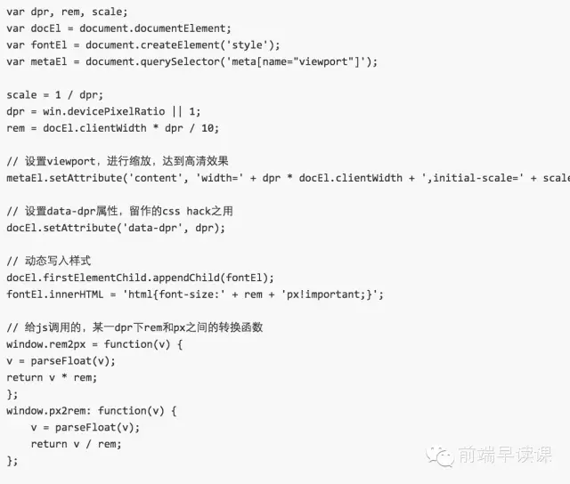

###0711笔记  

#### 1）移动端高清、多屏适配方案

[原文链接](http://mp.weixin.qq.com/s?__biz=MjM5MTA1MjAxMQ==&mid=206843290&idx=1&sn=a04dcc3b3d6fe9aac09c0b8b2d9cac02&key=c76941211a49ab5857eb15ee0d2b21a259d1e93cbce4cfc31db3e5f23f4bffaf6fc2ebd8cad86871a15ca8bbdd52c3ec&ascene=1&uin=MjE2MjUyNjQwMQ%3D%3D&devicetype=webwx&version=70000001&pass_ticket=1ZwnhM7Eh4NSLRksLgcaA7dnp9pkKP1UJ2bPw7Vqgv00r1S746H%2BWvoSNk5IdWPb)

开发移动端H5页面，面对不同分辨率和不同屏幕尺寸的手机。  

对于移动端开发而言，为了做到页面高清的效果，视觉稿的规范往往会遵循以下两点：  
1）首先，选取一款手机的屏幕宽高作为基准(以前是iphone4的320×480，现在更多的是iphone6的375×667)。   
2）对于retina屏幕(如: dpr=2)，为了达到高清效果，**视觉稿的画布大小会是基准的2倍**，也就是说像素点个数是原来的4倍（对iphone6而言：原先的375×667，就会变成750×1334）。  
对于2倍大小的视觉稿，在具体的css编码中如何还原每一个区块的真实宽高(也就是布局问题)?  

+ 物理像素(physical pixel)  
一个物理像素是显示器(手机屏幕)上**最小的物理显示单元**，在操作系统的调度下，每一个设备像素都有自己的颜色值和亮度值。
 
+ 设备独立像素(density-independentpixel)  
设备独立像素(也叫密度无关像素)，可以认为是计算机坐标系统中得一个点，这个点代表**一个可以由程序使用的虚拟像素**(比如: css像素)，然后由相关系统转换为物理像素。
所以说，物理像素和设备独立像素之间存在着一定的对应关系，这就是接下来要说的设备像素比。
 
+ 设备像素比(device pixel ratio )  
设备像素比(简称dpr)定义了物理像素和设备独立像素的对应关系，它的值可以按如下的公式的得到：
设备像素比 = 物理像素 / 设备独立像素 // 在某一方向上，x方向或者y方向 
 
在javascript中，可以通过**window.devicePixelRatio**获取到当前设备的dpr。

在普通屏幕下，1个css像素 对应 1个物理像素(1:1)。  
在retina 屏幕下，1个css像素对应 4个物理像素(1:4)。

#####实际应用
一：retina下，图片高清问题
这个问题上面已经介绍过解决方案了：两倍图片(@2x)，然后**图片容器缩小50%**。
如：图片大小，400×600;
###### img标签

	width : 200px;
	height : 300px;

###### 背景图片

	width:200px;
	height:300px;
	background-image:url(image/2.jpg);
	background-size:200px 300px; //或者background-size:contain;

但是对于普通屏幕，下载比容器大两倍的图片将会造成资源浪费，由于图片dowmsampling会失去一些锐利度。（肉眼看上去虽然图片不会模糊，但是会觉得图片缺少一些锐利度，或者是有点色差）

所以最好的解决办法是：不同的dpr下，加载不同的尺寸的图片。
不管是通过css媒体查询，还是通过javascript条件判断都是可以的。  
做的好的公司，都会有这么一个图片服务器，通过url获取参数，然后可以控制图片质量，也可以将图片裁剪成不同的尺寸。  

设计师想要的retina下border:1px;，其实就是1物理像素宽，对于css而言，可以认为是border: 0.5px;，这是retina下(dpr=2)下能显示的最小单位  
并不是所有手机浏览器都能识别border: 0.5px;，ios7以下，android等其他系统里，0.5px会被当成为0px处理，那么如何实现这0.5px呢

	.scale{
		position : relative;
	}
	.scale{
		content : "";
		position ：absolute；
		bottom ： 0px；
		left ：0px；
		right ：0px;
		border-bottom:1px solid #ddd;
		-webkit-transform :scaleY(.5);
		-webkit-transform-origin:0 0;
	}

###### 多屏适配布局问题

移动端布局，为了适配各种大屏手机，目前最好用的方案莫过于使用相对单位rem。
 
基于rem的原理，我们要做的就是: **针对不同手机屏幕尺寸和dpr动态的改变根节点html的font-size大小(基准值)**。
 
这里我们提取了一个公式(rem表示基准值)

	rem = document.documentElement.clientWidth * dpr / 10;

说明：
乘以dpr，是因为页面有可能为了实现1px border页面会缩放(scale) 1/dpr 倍(如果没有，dpr=1),。
除以10，是为了取整，方便计算(理论上可以是任何值)

css方式，可以通过设备宽度来媒体查询来改变html的font-size：

	html{font-size : 32px;}
	
	//iphone 6
	@media (min-device-width : 375px){
	    html{font-size:64px;}
	}
	@media (min-device-width : 414px){
	    html{font-size:75px;}
	}

javascript方式，通过上面的公式，计算出基准值rem，然后写入样式

